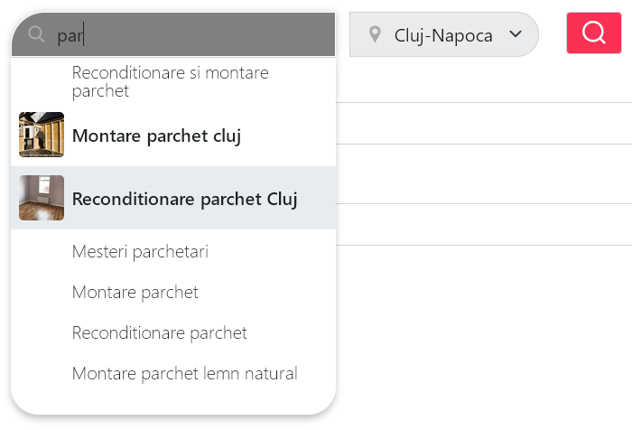
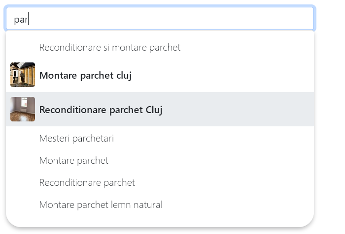
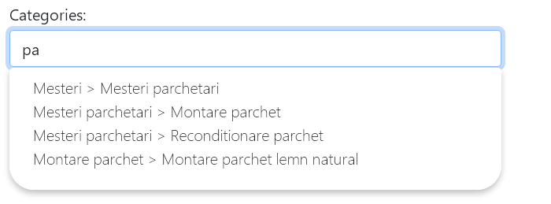
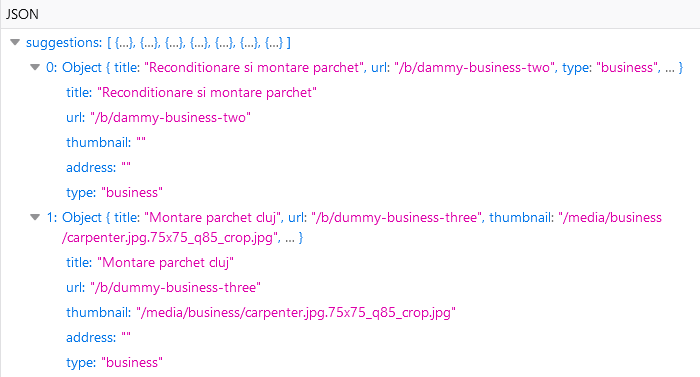
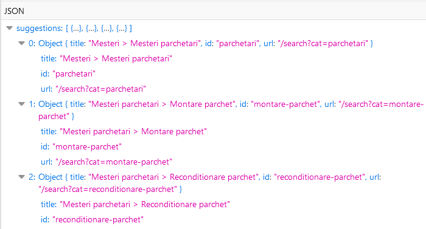

# ajax-cached-inputs
A js library which defines a google-like searchbar and a suggested category input.


### Features
* all AJAX calls are cached
* uses the Model-View-Controller pattern
* supports copy-pasting and keyboard events
* both widgets use the same generic code and overwrite functionalities


 
 
 

## Dependencies
JQuery 3.6.0, Bootstrap 5

## How to use it
First you have to include the html form.
Use a `unique_widget_id`.
```html 
    <form method="get" enctype="multipart/form-data">
        <div class="dropdown" id="unique_widget_id">
            <input type="text" class="form-control " placeholder="search">
            <ul class="dropdown-menu suggestions-dropdown" role="listbox"></ul>
        </div>
    </form>
```

Then you initialize the widget inside your js document ready function, 
using the same `unique_widget_id` and the proper `server ajax url`.
To use the search suggestion widget:
```js
    var widget0 = new SearchSuggestionsWidget('unique_widget_id', 'yourserver/search-suggestions-url');
    widget0.init();       
```

To use the category suggestion widget:
```js  
    var widget1 = new CategorySelectWidget('unique_widget_id', 'yourserver/category-suggestions-url');
    widget1.init();
```
Don't forget to include ajax-cached-inputs.js, jquery-3.6.0 and bootstrap 5.

Finally, you have to configure your server-side app to respond to your AJAX requests.


## Required AJAX responses:
The server-side app should respond to the AJAX calls with the expected JSON format.
For the search suggestions widget:    
 

    
For the category suggestions widget:    
 
